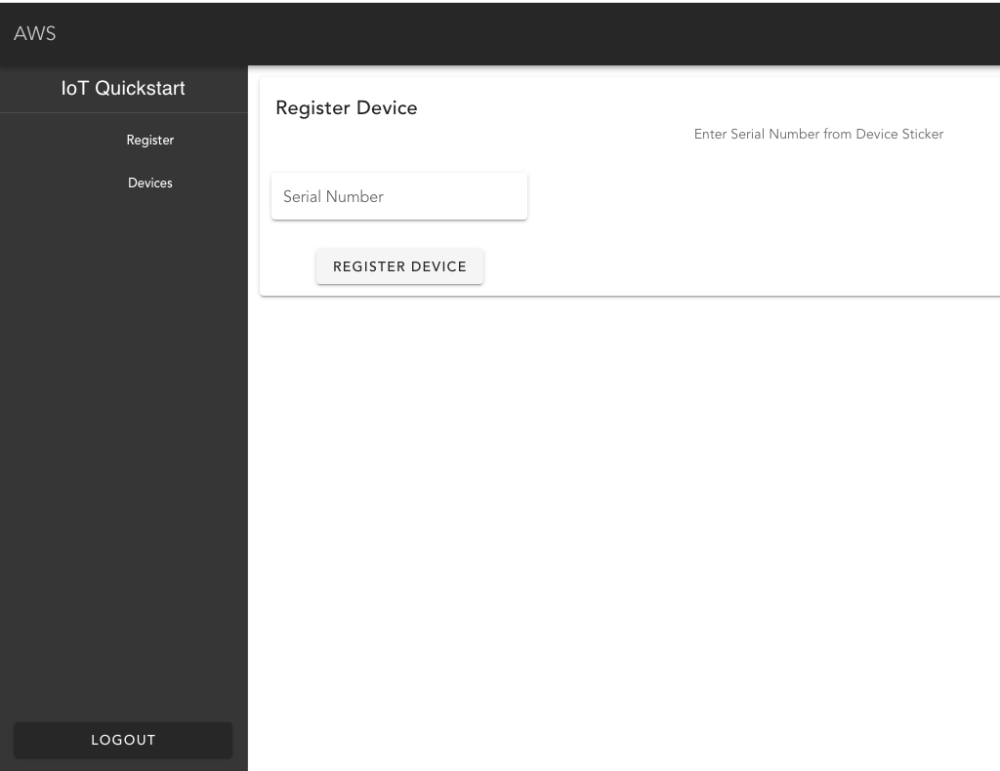
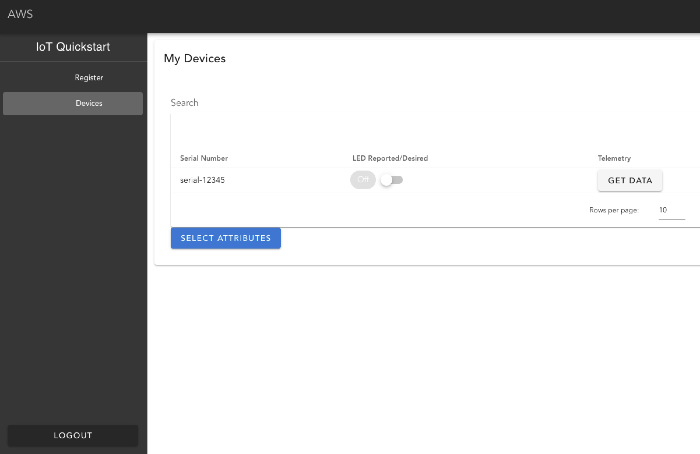

// Add steps as necessary for accessing the software, post-configuration, and testing. Don’t include full usage instructions for your software, but add links to your product documentation for that information.
//Should any sections not be applicable, remove them
NOTE: When the Cloudformation stack is complete, note the value for "DefaultDomain" under "Outputs". The setup process will continue after the initial Cloudformation stack is complete. It takes ~10 min to set up the full app using AWS Amplify after the first Cloudformation stack is complete. To check on status, login to the AWS Amplify console and select your app. Once the Quick Start is fully deployed, you can create an account with the "DefaultDomain" to view the web portal. To set up a custom domain for the web app, see Set up custom domains (https://docs.aws.amazon.com/amplify/latest/userguide/custom-domains.html).

== Test the deployment
// If steps are required to test the deployment, add them here. If not, remove the heading
You can validate that your Quick Start is deployed successfully, by logging onto the AWS IoT console to review the initial setup:

* Navigate to *Manage*, select *Thing Groups* from the left navigation, you should see pre-built thing groups listed on the page, such as ‘iotquickstart-Active’, ‘iotquickstart-inactive’, and ‘iotquickstart-Quarantine’ group.
* To check cloud-side IoT configurations against AWS security best practices, navigate to *Defend*, select *Audit*, then select *Schedules* from the left navigation, 
you should see a daily https://docs.aws.amazon.com/iot/latest/developerguide/device-defender-audit.html[audit^] created, such as ‘dailyaudit-main’.
* To verify that device behavior is being monitored on a continuous basis, navigate to *Defend*, select *Detect*, 
then select *Security Profiles* from the left navigation, you should see an https://docs.aws.amazon.com/iot/latest/developerguide/dd-detect-ml.html[ML Detect^] 
Security Profile configured, for example ‘SecurityProfile-152920-main’.

Secondly, you can test the device Just-in-Time Registration process included in the Quick Start:

* Have one device https://docs.aws.amazon.com/iot/latest/developerguide/iot-connect-devices.html[connect with your account’s AWS IoT data endpoint^]
* Once the device connects, the Quick Start performs a sequence of actions on the backend: 
    ** Generates an AWS IoT thing named with the Common Name (serial number) in the provided device certificate
    ** Attaches the device certificate to the created IoT thing
    ** Creates an AWS DynamoDB entry with the same Common Name for the device
    ** Adds the IoT thing to the ‘iotquickstart-inactive’ group’ with limited permissions
    ** Activates the device certificate
* Then you can verify the IoT thing, its device certificate and its group affiliation in the AWS IoT console by going to *Manage*, then *Things* from the left navigation. Once on this page you can identify the thing by it's certificate Common Name/serial number/thing name.

Finally, you can test the end user device registration process through the AWS Amplify web app included in the Quick Start:

* Log onto AWS Amplify via the AWS Management console
* You should see an ‘iotquickstart’ app already created under ‘All apps’; click the app
* Under the ‘Frontend environments’ tab, click the app image thumbnail and a new browser tab should open
* Create an account via the newly opened sign-up page
* Log in with the created account credentials and see a ‘Register Device’ page

[#testDeployment1]
.Register a device by serial number or common name
[link=images/Register_Device.png]

* Enter the serial number of the device that was previously connected and registered in AWS IoT and click ‘REGISTER DEVICE’; you should see a confirmation for successful registration
* Click ‘Devices’ in the left panel; you should also see the registered device now listed under ‘My Devices’

[#testDeployment2]
.A registered Device with a serial number
[link=images/My_Devices.png]

== Post-deployment steps
// If post-deployment steps are required, add them here. If not, remove the heading
=== From testing to production workloads
After verifying that the Quick Start is successfully deployed and it functions as intended, you can consider the following for your operational use:

1. Customize the pre-built AWS Amplify app in AWS CodeCommit so that the app meets your business use cases
2. Onboard IoT devices at the expected device provisioning rate of your operations so that you can validate the processing rate and scale of the solution

Once you are satisfied with the Quick Start’s app customization and load testing, you can deploy the solution in production.
//== Best practices for using {partner-product-short-name} on AWS
// Provide post-deployment best practices for using the technology on AWS, including considerations such as migrating data, backups, ensuring high performance, high availability, etc. Link to software documentation for detailed information.

//_Add any best practices for using the software._

== Security
// Provide post-deployment best practices for using the technology on AWS, including considerations such as migrating data, backups, ensuring high performance, high availability, etc. Link to software documentation for detailed information.

AWS Identity and Access Management (IAM) roles enable you to assign granular access policies and permissions to services and users in the AWS Cloud. 
This Quick Start creates IAM roles that grant the solution’s services, such as AWS Lambda functions, permissions to perform specific actions.

To deploy this Quick Start, you should have admin access, such as AWS managed IAM policy AdministratorAccess. 
After initial deployment, commits to the CodeCommit repository created by this Quick Start will build or update the Cloud infrastructure. To have the ability to update the CodeCommit repository, 
you should have an IAM role with the AWSCodeCommitPowerUser managed policy attached at a minimum. 

== Other useful information
//Provide any other information of interest to users, especially focusing on areas where AWS or cloud usage differs from on-premises usage.
=== CI/CD Pipeline

This project creates:

* CodeCommit repo in your account that is initialized with contents from the /submodules folder in the Github repo
* CI/CD enabled Amplify app that is triggered by commits to the CodeCommit repo (each commit will deploy updates to the backend and front end resources in your account)

All components described below are deployed as part of the initial Amplify app. You can customize by updating the CodeCommit repo.

=== App Components
==== Device Registration 
When a device first connects to AWS IoT Core with a new certificate, a message is sent to $aws/events/certificates/registered/${CACertificateID}. This triggers a lambda that

* Determines device Common Name (CN) from certificate
* Creates IoT thing using Common Name (CN) as the thingName
* Enters thing into product DynamoDB table without account so that a customer can later register this thing to their account
* Attaches the certificate to the IoT thing
* Adds the IoT thing to Inactive group with limited permissions
* Activates the certificate

=== End User Web App
The web application is a vuejs front end that is published by AWS Amplify. Amplify handles webpage file storage and distribution. The frontend interacts with the iotquickstartrest API Gateway. User identities are managed with Amazon Cognito. Users can exchanges their credentials for a JWT token. All API calls must include the JWT in the Authorization header, which also provides the Lambda function to register the customerAccount.

The following API endpoints are available:

* /deviceData/{thingName}: GET, deviceData lambda, Queries the last telemetry data points (up to 1 MB) for customerAccount-thingName
* /devices: GET, listdevices lambda, Queries customers devices (up to 1 MB)
* /register/{thingName}: GET, if thing is in Inactive thing group and not registered to a customer in the Dynamodb products table, the Lambda funciton moves thing from Inactive to Active thing group, updates thingName in product table to have key account={customerAccount}, and adds thing attribute account={customerAccount}.
* /thingshadow/${thingName}: POST, body={key=${shadowKey}, value=${shadowDesiredValue}}, checks if thingName is registered to customerAccount in product DynamoDB table. If yes, update thing shadow with desired value.

=== Command and Control
Registered and active IoT devices have permissions to publish/subscribe to topics to interact with their shadow. These devices can publish to:
....
$aws/things/${iot:Connection.Thing.ThingName}/shadow/update
$aws/things/${iot:Connection.Thing.ThingName}/shadow/get
....
and subscribe to:
....
$aws/things/${iot:Connection.Thing.ThingName}/shadow/update/accepted
$aws/things/${iot:Connection.Thing.ThingName}/shadow/update/rejected
$aws/things/${iot:Connection.Thing.ThingName}/shadow/update/documents
$aws/things/${iot:Connection.Thing.ThingName}/shadow/update/delta
$aws/things/${iot:Connection.Thing.ThingName}/shadow/get/accepted
$aws/things/${iot:Connection.Thing.ThingName}/shadow/get/rejected
....
Devices should publish the "reported" values within the shadow and read from the "desired" values. Cloud interactions should publish to "desired" and read from "reported" values in the shadow.

=== Device Management
Before registration, devices are placed in a preset inactive group group called ‘Inactive group’ with IoT policies not allowing communication between the device and AWS IoT Core. Upon registration and activation by the end user, devices are automatically placed under another preset active group group called ‘Active group’ with IoT policies granting the device the minimum privileges it needs to perform its functions. The Quick Start also creates two other device groups with their IoT policies for other device management use cases (e.g., troubleshooting, quarantining). All the IoT policies attached to the preset groups are customizable.

=== Security Management
AWS IoT Device Defender Audit (https://docs.aws.amazon.com/iot/latest/developerguide/device-defender-audit.html) is configured for daily checks. The results are sent to SNS and the device defenderAlert lambda. The Lambda function currently does not perform any tasks but can be customized to respond to Audit or ML Detect alarms for automated mitigation, for example, you can create a mitigation action that moves a device to quarantine thing group if authorization failures exceed a limit. AWS IoT Device Defender ML detect (https://docs.aws.amazon.com/iot/latest/developerguide/dd-detect-ml.html) is configured for monitoring device-level metrics including num-authorization-failures, message-byte-size, num-messages-sent, and num-messages-received.

NOTE: ML detect requires 14 days and a minimum of 25,000 datapoints per metric over the trailing 14-day period to build an initial model before it can perform device behavior evaluations.