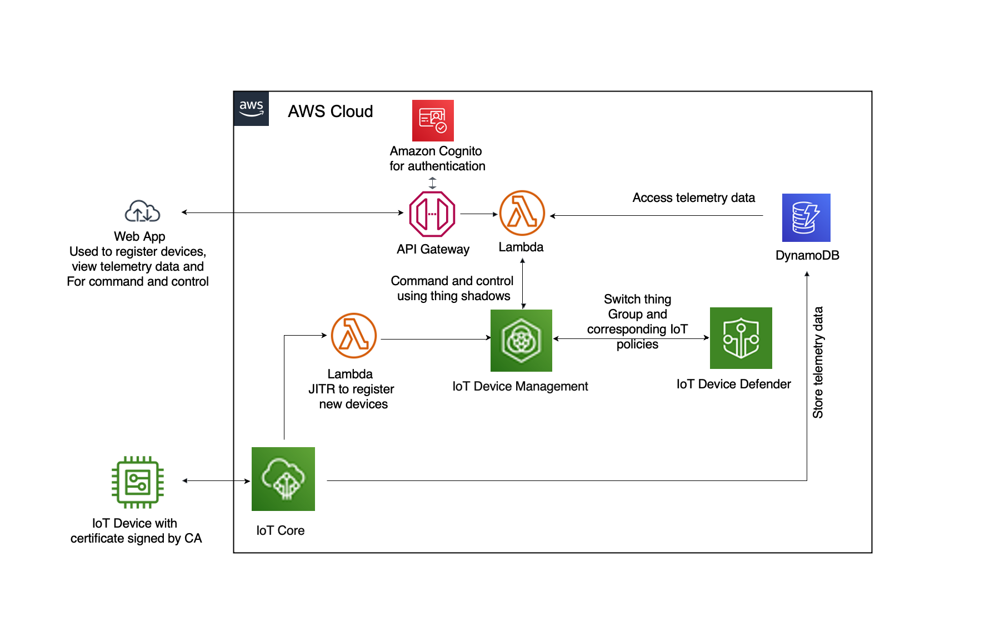

:xrefstyle: short

[#architecture1]
.IoT Connectivity and Security Quick Start conceptual diagram

As shown in <<architecture1>>, the Quick Start sets up the following:

* In the AWS Cloud:
    ** *AWS IoT Core* allows IoT device registration using a https://aws.amazon.com/blogs/iot/just-in-time-registration-of-device-certificates-on-aws-iot/[Lambda-based just in time registration^] with your own certificate authority (CA) and device certificates issued by the CA.
    ** *AWS IoT Device Management* sets up thing (device) groups, assigns devices to different thing groups based on the stage of IoT device life cycle (inactive, active, quarantine, and troubleshooting) and attaches IoT policies to each thing group to manage access control on the devices.
    ** *AWS IoT Core* also provides command and control of IoT devices using the Device Shadow capability.
    ** *AWS IoT Device Defender* audits IoT device cloud-side configurations against AWS security best practices and monitors device behaviors for anomalies once devices are connected with AWS IoT Core. It also provides built-in mitigation actions, such as switching a thing to a different thing group with the corresponding IoT policies attached, which can be used to respond to anomalies.
    ** *Amazon DynamoDB* supports both storing IoT device telemetry data and accessing such data via the end user web app.

* On the end user’s web app and device:
    ** *The end user’s web app* is created so that the consumer (purchaser) of an IoT device can sign up/sign into the app via Amazon Cognito, activate their device by making requests to Amazon API Gateway backed by a custom Lambda function; the app also allows the consumer (purchaser) to interact with the device for command and control and to view device telemetry.
    ** *The end user device* is registered in AWS IoT with the just-in-time registration process: 
        *** The end user device uses a device certificate issued by the registered CA as its unique identity; its device certificate is registered and activated in AWS IoT Core and attached to its thingName; its thingName is created in AWS IoT Core Registry with the CN of the device certificate; its thingName is also stored in Amazon DynamoDB to support the features of the web app.
        *** Upon end user activating the device, it is moved from the ‘Inactive Group’ to the ‘Active Group’ with IoT policies granting it with the minimum permissions it needs to perform its functions. 

=== Detailed Architecture 

[#architecture2]
.Architecture of the IoT Connectivity and Security Quick Start
image::../images/architecture_diagram.png[Architecture]

As shown in <<architecture2>>, the IoT Connectivity and Security Quick Starts sets up the following resources: 

*End user device and web app*

* *Device*. End-user IoT device.
* *Device agent*.  https://github.com/awslabs/aws-iot-device-client[AWS IoT Device Client^] or any supported MQTT client that lets you connect your devices to AWS IoT Core, and access AWS IoT Device Management and AWS IoT Device Defender features by default. 
* *Internet*. The public web.
* *End user web app:* The web app is a vuejs front end that is published by AWS Amplify. Amplify handles webpage file storage and distribution. The frontend interacts with the iotquickstartrest API Gateway. User identities are managed with Amazon Cognito. Users can exchange their credentials for a JWT token. All API calls must include the JWT in the Authorization header, which also provides the Lambda function to register the customerAccount.

*IoT Core*

* AWS IoT Core facilitates https://aws.amazon.com/blogs/iot/just-in-time-registration-of-device-certificates-on-aws-iot/[IoT device just in time registration^] using an AWS Lambda backed AWS IoT rule on the registration topic: $aws/events/certificates/registered/+ .
* *Lambda JITR*. AWS IoT rule triggers the Lambda JITR function to register the device and place it in the ‘Inactive Group’ under AWS IoT Device Management.
* AWS IoT Core facilitates IoT device shadow update for command and control using an AWS Lambda rule on the Shadow update topic: $aws/things/thingName/shadow/update/accepted .
* AWS IoT Core collects IoT device telemetry data to a designated topic: dt/foundationapp/#/sensor1 . 

*IoT Device Management*

* The service sets up thing (device) groups and assigns devices to different thing groups based on the stage of IoT device life cycle (inactive, active, quarantine, and troubleshooting).
* *IoT policies*: AWS IoT Device Management attaches IoT policies to each thing group to manage access control on the devices.
* *IoT Things/Shadows*: Each device is registered in AWS IoT registry as a “thing“ with thing attributes (e.g., thingName, identity in the form of X.509 certificate) and owns one or multiple shadow (https://docs.aws.amazon.com/iot/latest/developerguide/iot-device-shadows.html) documents to describe its state.

*IoT Device Defender*

* This service audits IoT device cloud-side configurations against AWS security best practices and monitors device behaviors for anomalies once devices are connected with AWS IoT Core.
* It also provides prebuilt mitigation actions such as switching a thing to a different thing group and achieving actions such as quarantine with the corresponding IoT policies attached to the thing group
* *CloudWatch.* AWS IoT Device Defender publishes audit and detect alarms to Amazon CloudWatch as metrics.
* *Simple Notification Service.* AWS IoT Device Defender also publishes audit and detect alarms to Amazon SNS if you configured SNS topics to receive Device Defender alarms.

*API Get Data & API: Command/Control*
The Quick Start uses the following API endpoints:

* /register/{thingName}: GET, if thing is in Inactive thing group and not registered to a customer in the Dynamodb products table, the Lambda function moves thing from Inactive to Active thing group, updates thingName in product table to have key account={customerAccount}, and adds thing attribute account={customerAccount}.
* /thingshadow/${thingName}: POST, body={key=${shadowKey}, value=${shadowDesiredValue}}, checks if thingName is registered to customerAccount in product DynamoDB table. If yes, update thing shadow with desired value.
* /deviceData/{thingName}: GET, deviceData lambda, Queries the last telemetry data points (up to 1 MB) for customerAccount-thingName
* /devices: GET, listdevices lambda, Queries customers devices (up to 1 MB)

*Lambda: Command/Control & Lambda Query Data*. The Lambda functions used for the API requests described above to activate a device, update a device shadow (command and control), and query customer devices and device telemetry. 

*Update thing shadow desired.* The API request /thingshadow/${thingName}: POST, body={key=${shadowKey}, value=${shadowDesiredValue}} described above achieves this action.

*DynamoDB.* This service supports both storing IoT device telemetry data and accessing such data via the end user web app.

=== CI/CD pipeline

This project creates:

* CodeCommit repo in your account that is initialized with contents from the /submodules folder in the Github repo
* CI/CD enabled Amplify app that is triggered by commits to the CodeCommit repo (each commit will deploy updates to the backend and front end resources in your account)

All components described below are deployed as part of the initial Amplify app. You can customize by updating the CodeCommit repo.

=== Functional components
==== Device registration 
When a device first connects to AWS IoT Core with a new certificate, a message is sent to $aws/events/certificates/registered/${CACertificateID}. This triggers a lambda that

* Determines device Common Name (CN) from certificate
* Creates IoT thing using Common Name (CN) as the thingName
* Enters thing into product DynamoDB table without account so that a customer can later register this thing to their account
* Attaches the certificate to the IoT thing
* Adds the IoT thing to Inactive group with limited permissions
* Activates the certificate

=== End user web application

From past AWS IoT projects, we learned that many of our customers would like to use a solution with a pre-built component that facilitates consumer (purchaser) 
device activation. This Quick Start associates a registered device of the manufacturer/operator with a consumer (purchaser) and validates the authorized use of the 
device as well as related services. In addition, our customers often want a solution that provides device command and control and health/usage telemetry reporting to the end user. 
With these two use cases in mind, 
we created this baseline app to help customers bootstrap their solution quickly with the ability to further customize the app using AWS Amplify.

The following API endpoints are available:

* /deviceData/{thingName}: GET, deviceData lambda, Queries the last telemetry data points (up to 1 MB) for customerAccount-thingName
* /devices: GET, listdevices lambda, Queries customers devices (up to 1 MB)
* /register/{thingName}: GET, if thing is in Inactive thing group and not registered to a customer in the Dynamodb products table, 
the Lambda function moves thing from Inactive to Active thing group, updates thingName in product table to have key account={customerAccount}, and adds thing attribute account={customerAccount}.
* /thingshadow/${thingName}: POST, body={key=${shadowKey}, value=${shadowDesiredValue}}, 
checks if thingName is registered to customerAccount in product DynamoDB table. If yes, update thing shadow with desired value.

=== Device data
Registered and active IoT devices have permission to publish to dt/${thingName}/#. 
An IoT rule directs telemetry messages from this topic to a dynamodb telemetry table with primary key = customerId:thingName and sort key=Epoch timestamp. 
CustomerId is obtained from the thing attribute value for account and thingName is obtained from the topic.

=== Command and control
Registered and active IoT devices have permissions to publish/subscribe to topics to interact with their shadow. These devices can publish to:
....
$aws/things/${iot:Connection.Thing.ThingName}/shadow/update
$aws/things/${iot:Connection.Thing.ThingName}/shadow/get
....
and subscribe to:
....
$aws/things/${iot:Connection.Thing.ThingName}/shadow/update/accepted
$aws/things/${iot:Connection.Thing.ThingName}/shadow/update/rejected
$aws/things/${iot:Connection.Thing.ThingName}/shadow/update/documents
$aws/things/${iot:Connection.Thing.ThingName}/shadow/update/delta
$aws/things/${iot:Connection.Thing.ThingName}/shadow/get/accepted
$aws/things/${iot:Connection.Thing.ThingName}/shadow/get/rejected
....
Devices should publish the "reported" values within the shadow and read from the "desired" values. Cloud interactions should publish to "desired" and read from "reported" values in the shadow.

=== Device management
Before registration, devices are placed in a preset inactive group called ‘Inactive group’ with IoT policies not allowing communication between the device and AWS IoT Core. 
Upon registration and activation by the end user, devices are automatically placed under another preset active group 
with IoT policies granting the device the minimum privileges it needs to perform its functions. 
The Quick Start also creates two other device groups with their IoT policies for other device management use cases (e.g., troubleshooting, quarantining). 
All the IoT policies attached to the preset groups are customizable.

=== Security management
https://docs.aws.amazon.com/iot/latest/developerguide/device-defender-audit.html[AWS IoT Device Defender Audit^] is configured for daily checks. 
The results are sent to SNS and the device defenderAlert lambda. The Lambda function currently does not perform any tasks but can be customized to respond to Audit or ML Detect alarms for automated mitigation, 
for example, you can create a mitigation action that moves a device to quarantine thing group if authorization failures exceed a limit. 
https://docs.aws.amazon.com/iot/latest/developerguide/dd-detect-ml.html[AWS IoT Device Defender ML detect^] is configured for monitoring device-level metrics including num-authorization-failures, message-byte-size, num-messages-sent, and num-messages-received.

NOTE: ML detect requires 14 days and a minimum of 25,000 datapoints per metric over the trailing 14-day period to build an initial model before it can perform device behavior evaluations.