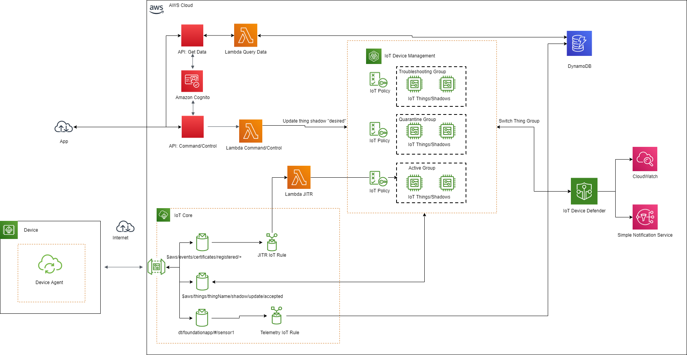

Deploying this Quick Start with
*default parameters* builds the following _{partner-product-name}_ environment in the
AWS Cloud.

// Replace this example diagram with your own. Send us your source PowerPoint file. Be sure to follow our guidelines here : http://(we should include these points on our contributors giude)
[#architecture1]
.Quick Start architecture for _{partner-product-name}_ on AWS
[link=images/architecture_diagram.png]


As shown in Figure 1, the Quickstart sets up the following:

* IoT device registration on first connect using https://aws.amazon.com/blogs/iot/just-in-time-registration-of-device-certificates-on-aws-iot/[just in time registration^] with your own certificate authority 
* End customer web application for end customer to register devices to their account, viewing device telemetry data of registered devices, and performing command and control for registered devices
* IoT device telemetry
* IoT device command and control
* IoT device security management using ML detect and security audits

== CI/CD Pipeline
This project creates:

* Codecommit repo in your account that is initialized with contents from the /source folder in this Github repo
* CI/CD enabled Amplify app that is triggered by commits to the CodeCommit repo (each commit will deploy updates to the backend and front end resources in your account)

All components described after this section are deployed as part of the initial Amplify app. This app is meant as a starting point that you can customize by updating the codecommit repo.

== App Components

=== Device Registration
When a device first connects with a new certificate, a message is sent to $aws/events/certificates/registered/${CACertificateID}. This triggers a lambda that

* Determines device Common Name (CN) from certificate
* Creates IoT thing using Common Name (CN) as the thingName
* Enters thing into product dynamodb table without account so that a customer can later register this thing to their account
* Attaches the certificate to the IoT thing
* Adds the IoT thing to Inactive group with limited permissions
* Activates the certificate

=== End Customer Web App
The web application is a vuejs front end that is published using Amplify. Amplify handles webpage file storage and distribution.
The frontend interacts with the iotquickstartrest API Gateway. Users are managed with Cognito such the user exchanges credentials for a JWT.
All API calls must include the JWT in the Authorization header, which also provides the lambda with the customerAccount. 

The following API endpoints are available:

* /deviceData/{thingName}: GET, deviceData lambda, Queries the last telemetry data points (up to 1 MB) for customerAccount-thingName
* /devices: GET, listdevices lambda, Queries customers devices (up to 1 MB)
* /register/{thingName}: GET, if thing is in Inactive thing group and not registered to a customer in the dynamodb products table, lambda moves thing from Inactive to Active thing grou, updates thingName in product table to have key account={customerAccount}, and adds thing attribute account={customerAccount}.
* /thingshadow/${thingName}: POST, body={key=${shadowKey}, value=${shadowDesiredValue}}, checks if thingName is registered to customerAccount in product dynamodb table. If yes, updates thing shadow desired value.

=== Telemetry
IoT devices that are registered to a customer and are active have permission to publish to dt/${thingName}/#. 
An IoT rule directs telemetry messages from this topic to a dynamodb telemetry table with primary key = customerId:thingName and sort key=Epoch timestamp. CustomerId is obtained from thing attribute value for account and thingName is obtained from the topic.

=== Command and control
IoT devices that are registered to a customer and are active have permissions to publish/subscribe to topics to interact with their shadow.
These devices can publish to:
```
$aws/things/${iot:Connection.Thing.ThingName}/shadow/update
$aws/things/${iot:Connection.Thing.ThingName}/shadow/get 
```
and subscribe to:
```
$aws/things/${iot:Connection.Thing.ThingName}/shadow/update/accepted
$aws/things/${iot:Connection.Thing.ThingName}/shadow/update/rejected
$aws/things/${iot:Connection.Thing.ThingName}/shadow/update/documents
$aws/things/${iot:Connection.Thing.ThingName}/shadow/update/delta
$aws/things/${iot:Connection.Thing.ThingName}/shadow/get/accepted
$aws/things/${iot:Connection.Thing.ThingName}/shadow/get/rejected
```
Devices should publish the "reported" values within the shadow and read from the "desired" values. Cloud interactions should publish to "desired" and read from "reported" values in the shadow.

=== Security Management
All IoT device defender audits are configured for daily checks. The results are sent to SNS and the device defenderAlert lambda.
IoT device defender ML detect is used for num-authorization-failures, message-byte-size, num-messages-sent, and num-messages-received. Alerts are sent to SNS and the device defenderAlert lambda but ML detect requires 14 days to determine account baseline values before alerts will begin.
