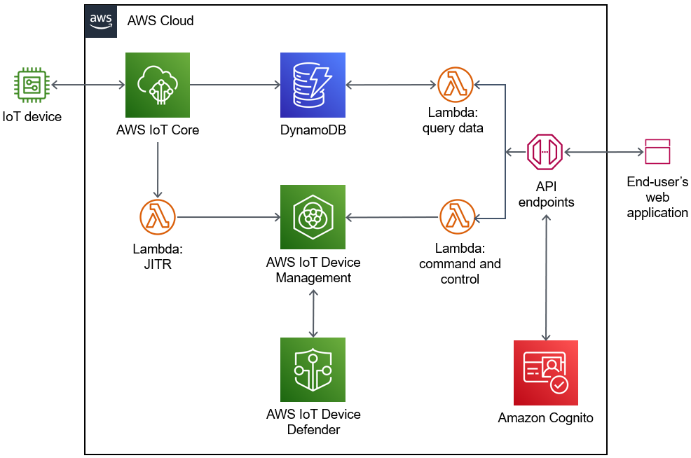

:xrefstyle: short
Deploying this Quick Start with default parameters builds the following {partner-product-short-name} environment in the AWS Cloud.

[#architecture1]
.IoT {partner-product-short-name} Quick Start architecture diagram

As shown in <<architecture1>>, the Quick Start sets up the following:

* AWS IoT Core, which you can use to register IoT devices using a Lambda-based just-in-time registration (JITR) with your own certificate authority (CA) and device certificates issued by the CA. This service uses device shadows to provide command and control of IoT devices.
* Amazon DynamoDB, which supports storing device telemetry data and accessing such data using the web application.
* AWS IoT Device Management, which you use to organize, monitor, and manage IoT devices.
* AWS IoT Device Defender, which audits device cloud-side configurations against AWS security best practices. This service also monitors device behaviors for anomalies after the devices are connected with AWS IoT Core.
* Amazon API Gateway endpoints for device activation, command and control, and queries.
* Amazon Cognito, which manages the identities of the IoT devices' users. You use this service to access the web application.
* AWS Lambda functions:
** A JITR function that registers the IoT devices.
** A command-and-control function that updates the device shadows. 
** A function that queries IoT devices and device telemetry.
* An AWS CodeCommit repository. You can customize your web application by committing changes to the CodeCommit repository.
* An AWS Amplify continuous integration and continuous delivery (CI/CD) pipeline for use by the AWS CodeCommit repository. You use this pipeline when you customize your web application.  
* A web application for registering and interacting with your IoT devices. You use this web application to automate provisioning and help you secure your devices for development, testing, and production without having to log in to the AWS IoT console.

//TODO Miles, Where does the web application live if not in the AWS Cloud? -- not sure what you mean by this feedback
//I ask because it seems strange to show the icon outside the AWS Cloud box in the diagram.

//TODO Miles, Should "device activation" above be "device registration"?