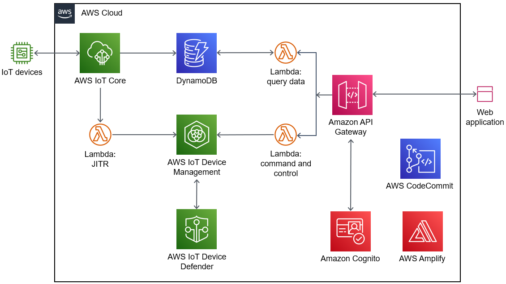

:xrefstyle: short
Deploying this Quick Start with default parameters builds the following {partner-product-short-name} environment in the AWS Cloud.

[#architecture1]
.IoT {partner-product-short-name} Quick Start architecture diagram

As shown in <<architecture1>>, the Quick Start sets up the following:

* AWS IoT Core, which you can use to register IoT devices using a Lambda-based just-in-time registration (JITR) with your own certificate authority (CA) and device certificates issued by the CA. This service uses device shadows to provide command and control of IoT devices.
* Amazon DynamoDB, which supports storing device telemetry data and accessing such data using the web application.
* AWS IoT Device Management, which you use to organize, monitor, and manage IoT devices.
* AWS IoT Device Defender, which audits device cloud-side configurations against AWS security best practices. This service also monitors device behaviors for anomalies after the devices are connected with AWS IoT Core.
* Amazon API Gateway endpoints for device activation, command and control, and queries.
* Amazon Cognito, which manages the identities of the IoT devices' users. You use this service to access the web application.
* AWS Lambda functions:
** A JITR function that registers the IoT devices.
** A command-and-control function that updates the device shadows. 
** A function that queries IoT devices and device telemetry.
* An AWS CodeCommit repository with an AWS Amplify continuous integration and continuous delivery (CI/CD) pipeline. You can customize your deployment by committing changes to the Amplify repository.
* A web application for activating and interacting with your IoT devices.

//TODO Miles, Where does the web application live if not in the AWS Cloud?

//TODO Miles, Is "activating" a device the same as "registering" it? (We use the term "activation"/"activating" twice above.)

//TODO Miles, It's confusing to refer to first the "CodeCommit repository" and then the "Amplify repository." Which is it? 

//TODO Miles, CodeCommit and Amplify need separate bullets. What's the function of each (distinctly)?

//TODO Miles, Here we say that you "customize your deployment" by "committing changes to the Amplify repository." Later we say that you "customize the web application" by using AWS CodeCommit. Need crisper language wherever we talk about customizing.