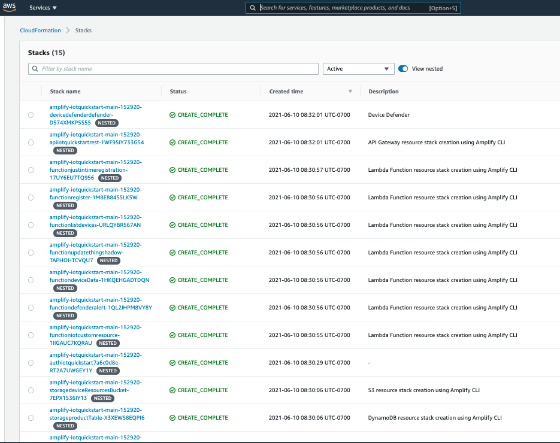

// We need to work around Step numbers here if we are going to potentially exclude the AMI subscription
=== Sign in to your AWS account

. Sign in to your AWS account at https://aws.amazon.com with an IAM user role that has the necessary permissions. For details, see link:#_planning_the_deployment[Planning the deployment] earlier in this guide.
. Make sure that your AWS account is configured correctly, as discussed in the link:#_technical_requirements[Technical requirements] section.

=== Launch the Quick Start
[cols=",]
|===
|http://qs_launch_link[Deploy {partner-product-name} into your AWS account^] 
|===

Each deployment takes about {deployment_time} to complete.

[start=3]
. Check the AWS Region that’s displayed in the upper-right corner of the navigation bar, and change it if necessary. 
This is where the network infrastructure for {partner-product-name} will be built. The template is launched in the {default_deployment_region} Region by default.

[start=4]
. On the *Create stack* page, keep the default setting for the template URL, and then choose *Next*.
[start=5]
. On the *Specify stack details* page, change the stack name if needed. Review the parameters for the template. Provide values for the parameters that require input. For all other parameters, 
review the default settings and customize them as necessary.
* Parameter: CACertificateID, see instructions for creating a https://aws.amazon.com/blogs/iot/just-in-time-registration-of-device-certificates-on-aws-iot/[certificate authority^] and https://docs.aws.amazon.com/iot/latest/developerguide/register-CA-cert.html[registering within AWS IoT^].
* Device/client certificate: Use the CA to create certificates for devices. 
The *Common Name* of the device certificate you create should also be the serial number you assign to the device and provide to end users for device activation. 

When the Cloudformation stack is complete, note the value for "DefaultDomain" under "Outputs". The setup process will continue after the initial Cloudformation stack is complete. 
It takes {deployment_time} to set up the full app using AWS Amplify after the first Cloudformation stack is complete. To check on status, login to the AWS Amplify console and select your app. Once the Quick Start is fully deployed, you can create an account with the "DefaultDomain" to view the web portal. 
To set up a custom domain for the web app, see https://docs.aws.amazon.com/amplify/latest/userguide/custom-domains.html[Set up custom domains].  

In the following table, parameters are listed by category and described separately for the deployment options. When you finish reviewing and customizing the parameters, choose *Next*.
ifndef::production_build[]
++++

++++
endif::production_build[]
include::../{specificdir}/parameter_category_table.adoc[]
ifndef::production_build[]
++++

endif::production_build[]

NOTE: Unless you are customizing the Quick Start templates for your own deployment projects, we recommend that you keep the default settings for the parameters labeled `Quick Start S3 bucket name`, `Quick Start S3 bucket
Region`, and `Quick Start S3 key prefix`. Changing these parameter settings automatically updates code references to point to a new Quick Start location. For more information, see the https://aws-quickstart.github.io/option1.html[AWS Quick Start Contributor’s Guide^].

// Parameter tables linked in here
include::../{generateddir}/parameters/index.adoc[]

[start=6]
. On the options page, you can https://docs.aws.amazon.com/AWSCloudFormation/latest/UserGuide/aws-properties-resource-tags.html[specify tags^] (key-value pairs) for resources in your stack and https://docs.aws.amazon.com/AWSCloudFormation/latest/UserGuide/cfn-console-add-tags.html[set advanced options^]. When you’re done, choose *Next*.
. On the *Review* page, review and confirm the template settings. Under *Capabilities*, select the two check boxes to acknowledge that the template creates IAM resources and might require the ability to automatically expand macros.
. Choose *Create stack* to deploy the stack.
ifndef::partner-product-short-name[. Monitor the status of the stack. When the status is *CREATE_COMPLETE*, the {partner-product-name} deployment is ready.]
ifdef::partner-product-short-name[. Monitor the status of the stack. When the status is *CREATE_COMPLETE*, the {partner-product-short-name} deployment is ready.]
. Use the values displayed in the *Outputs* tab, as shown below, to view the created resources.

:xrefstyle: short
[#cfn_outputs]
ifndef::partner-product-short-name[.{partner-product-name} outputs after successful deployment]
ifdef::partner-product-short-name[.{partner-product-short-name} outputs after successful deployment]
[link=images/cfn_outputs.png]
